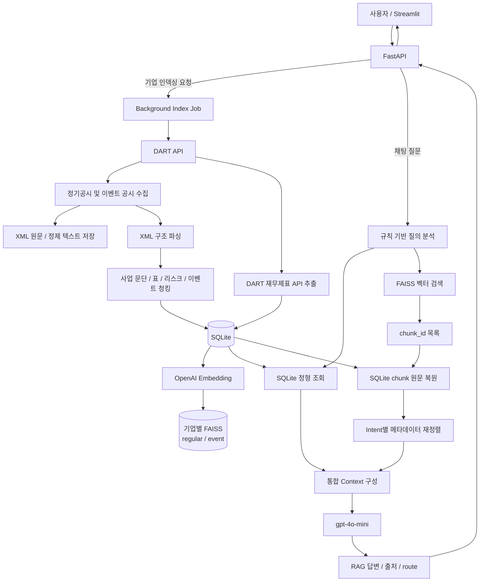
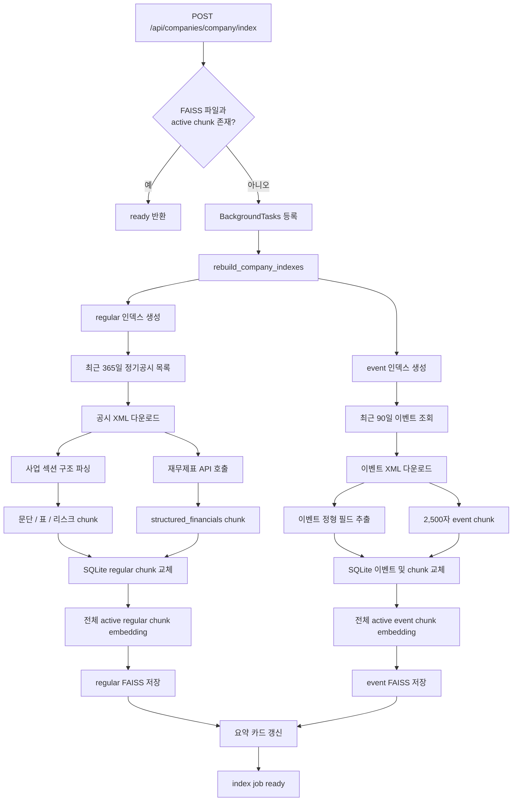
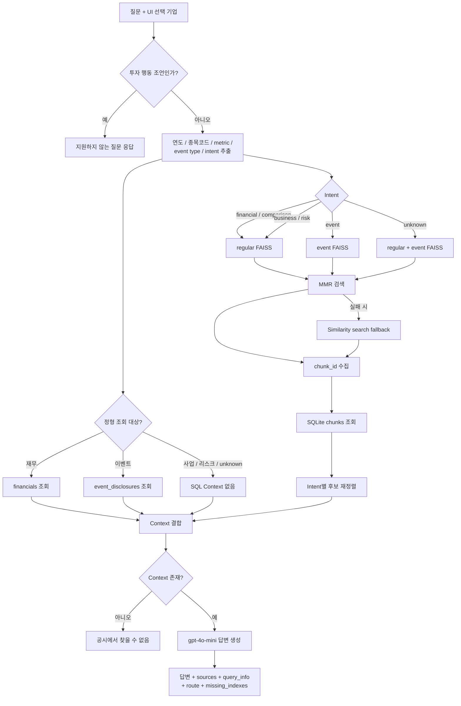

# RAG Flow Inspection

조사일: 2026-06-10 (Asia/Seoul)

## 1. 조사 범위

이 문서는 현재 작업 트리의 DART 공시 RAG 구현을 코드, SQLite 데이터,
FAISS 파일, 실행 로그, RAGAS 평가 결과를 기준으로 조사한 결과다.

- 브랜치: `main`
- 기준 커밋: `34063ef`
- 가상환경: `source ../../venv.sh`
- 실제 스크립트 이름은 요청에 적힌 `vens.sh`가 아니라 `venv.sh`다.
- 조사 시점에 `api_server.py`, `rag_service.py`, DB, 프론트엔드 등에
  커밋되지 않은 변경이 존재한다. 따라서 이 문서는 커밋 상태가 아니라 현재
  작업 트리를 설명한다.

조사 중 기존 소스와 데이터는 수정하지 않았으며 이 문서만 추가했다.

## 2. 요약

이 저장소의 RAG는 다음과 같은 하이브리드 구조다.

```text
기업 선택/인덱싱 요청
  -> DART 정기공시 및 이벤트 공시 수집
  -> XML 원문과 정제 텍스트 저장
  -> 사업 섹션 구조 파싱 및 청킹
  -> SQLite에 공시, 재무, 이벤트, chunk 저장
  -> OpenAI embedding 생성
  -> 기업별 regular/event FAISS 인덱스 생성

질문
  -> 규칙 기반 intent 및 종목코드 추출
  -> intent별 SQLite 정형 조회
  -> intent별 regular/event FAISS 검색
  -> FAISS가 반환한 chunk_id로 SQLite 원문 복원
  -> 메타데이터 기반 후보 재정렬
  -> SQLite Context + 공시 Context 결합
  -> gpt-4o-mini 답변
  -> 답변, 출처, route, 누락 인덱스 반환
```

FAISS는 원문의 기준 저장소가 아니다. FAISS 문서에는 빈 본문과 `chunk_id`
중심의 메타데이터만 들어가고, 실제 답변 근거는 SQLite `chunks` 테이블에서
다시 읽는다. 이 설계는 원문과 메타데이터를 한 곳에서 관리한다는 장점이 있다.

현재 가장 중요한 문제는 다음과 같다.

1. 기간별 재무 질문에서 보고서 종류를 SQL 조회에 적용하지 않는다.
2. 한글 조사와 붙은 종목코드를 정규식이 인식하지 못한다.
3. 재색인이 트랜잭션 또는 세대 교체 방식이 아니어서 중간 실패에 취약하다.
4. DB의 active chunk/mapping과 실제 FAISS 파일이 불일치하는 기업이 있다.
5. 라우팅 어휘가 좁아 사업 질문 상당수가 `unknown`으로 분류된다.
6. 검색 점수 임계값과 reranker가 없고, 대부분 항상 8개 문서를 Context에 넣는다.
7. 환경변수 파일을 읽는 위치가 모듈마다 달라 실행 경로에 따라 동작이 달라진다.

## 3. RAG 흐름도

### 3.1 전체 흐름



### 3.2 인덱싱 흐름



현재 구현에서 chunk 교체, embedding, FAISS 저장은 하나의 원자적 작업으로
묶이지 않는다. 흐름 중간에 실패하면 이전 chunk가 비활성화된 상태, 일부 새
chunk만 저장된 상태, DB와 FAISS가 다른 세대를 가리키는 상태가 생길 수 있다.

### 3.3 질문 검색 및 답변 흐름



Intent별 실질 데이터 경로는 다음과 같다.

| 질문 유형 | SQLite Context | FAISS | 최종 route 이름 |
|---|---|---|---|
| 기업 전체 재무 수치 | `financials` | regular | `structured_api` |
| 기업 간 재무 비교 | `financials` | regular | `structured_api` |
| 사업 내용 | 없음 | regular | `raw_filing_rag` |
| 리스크 | 없음 | regular | `raw_filing_rag` |
| 이벤트 공시 | `event_disclosures` | event | `event_filing_rag` |
| 분류 불명 | 없음 | regular + event | `both` |

`structured_api`라는 이름과 달리 재무 질문도 regular FAISS를 함께 검색한다.
또한 FAISS 검색 결과의 본문을 직접 신뢰하지 않고 `chunk_id`를 통해 SQLite
원문을 다시 읽는 것이 현재 구조의 핵심이다.

## 4. 주요 구성요소

| 역할 | 파일 |
|---|---|
| FastAPI 진입점, 인덱싱 작업, 채팅 API | `backend/src/api_server.py` |
| 전체 인덱싱 오케스트레이션 | `backend/src/pipeline.py` |
| DART 공시 수집과 이벤트 정규화 | `backend/src/dart_service.py` |
| XML 파싱, 사업 섹션 추출, 청킹 | `backend/src/document_processor.py` |
| SQLite schema와 CRUD | `backend/src/finance_store.py` |
| embedding, FAISS 생성과 검색 | `backend/src/index_manager.py` |
| 질의 라우팅, 검색, Context, 답변 | `backend/src/rag_service.py` |
| 요약 카드 생성과 cache | `backend/src/summary_service.py` |
| RAGAS 평가 | `eval/run_ragas.py` |

설정값은 `backend/src/config.py`에 있다.

```text
embedding model: text-embedding-3-small
answer model:    gpt-4o-mini
regular range:   최근 365일
event range:     최근 90일
index types:     regular, event
```

설치된 주요 버전은 다음과 같다.

```text
langchain             1.3.2
langchain-openai      1.2.2
langchain-community   0.3.31
faiss-cpu             1.14.2
openai                2.38.0
ragas                 0.4.3
fastapi               0.136.3
streamlit             1.57.0
OpenDartReader        0.2.2
```

## 5. 인덱싱 흐름

### 4.1 시작 조건

프론트엔드에서 기업을 선택하면
`POST /api/companies/{company}/index`를 호출한다. 서버는 프로세스 메모리의
`_jobs`에 작업을 등록하고 FastAPI `BackgroundTasks`로
`rebuild_company_indexes()`를 실행한다.

`_current_index_status()`는 다음 두 조건을 함께 확인한다.

- `index.faiss`가 존재한다.
- 해당 기업/index type에 active chunk가 하나 이상 있다.

regular 또는 event 중 하나만 usable이어도 기업 전체 상태는 `ready`다. 따라서
regular만 존재하고 event가 없어도 자동 인덱싱 요청은 이미 준비된 것으로
간주되어 반환될 수 있다.

작업 상태와 watchlist는 프로세스 메모리에만 있으므로 서버 재시작 시 사라진다.

### 4.2 정기공시 수집

`collect_recent_regular_filings()`는 현재 날짜 기준 최근 365일의 DART `kind=A`
목록에서 다음 보고서만 수집한다.

- 사업보고서
- 반기보고서
- 분기보고서

접수번호별 XML 원문을 다음 경로에 저장한다.

```text
backend/storage/companies/{stock_code}/raw/{receipt_no}.xml
```

각 보고서에 대해 DART `finstate()` API도 호출하여 다음 정형 값을 추출한다.

- 매출액
- 영업이익
- 당기순이익
- 사업연도
- 보고서 코드와 대상 월

보고서 코드는 `11011` 사업보고서, `11012` 반기보고서, `11013` 1분기,
`11014` 3분기를 사용한다.

### 4.3 XML 파싱과 regular chunk

`parse_filing_document()`는 BeautifulSoup과 lxml로 XML/HTML을 순회한다.

- 제목과 문단을 block으로 만든다.
- 표는 Markdown table block으로 변환한다.
- `II. 사업의 내용` 시작부터 재무제표 시작 전까지를 사업 영역으로 본다.
- 제목 계층을 `section_path`로 보존한다.

문단은 `RecursiveCharacterTextSplitter`로 분리한다.

```text
child chunk size:    1400자
child overlap:       160자
fallback chunk size: 2500자
fallback overlap:    300자
```

표는 별도 분할 없이 한 개의 `table_text` chunk가 된다. 실제 DB에서 가장 긴
표 chunk는 6,115자였다. 따라서 설정된 child size는 표에는 적용되지 않는다.

생성되는 regular 데이터 유형은 다음과 같다.

| data_type | 내용 |
|---|---|
| `structured_financials` | DART 재무 API 값으로 만든 요약 |
| `business_text` | 사업 섹션 일반 문단 |
| `table_text` | Markdown으로 변환한 표 |
| `risk_text` | 위험 섹션 또는 위험 키워드 문단 |

일반 사업 문단이 위험 키워드 조건을 만족하면 동일한 내용을 `risk_text`로 한 번
더 저장한다. 동일 문자열은 label과 section metadata가 달라 DB의 완전 중복
content로 집계되지는 않지만, 의미상 중복 벡터가 생길 수 있다.

### 4.4 이벤트 공시

이벤트 수집은 두 경로를 합친다.

1. OpenDartReader `dart.event()`를 이벤트 키워드별로 호출
2. 일반 공시 목록의 보고서명을 정규식으로 검사

이벤트 chunk는 정형 이벤트 요약과 정제 원문을 결합한 후 2,500자,
overlap 200자로 분리한다.

일부 전환사채, 타법인 증권 취득, 합병 관련 공시는 원문에서 대상회사와
지급방법을 추출하기 위해 `gpt-4o-mini`를 추가 호출할 수 있다. 이 호출은
인덱싱 단계 비용과 실패 지점을 늘린다.

### 4.5 SQLite 교체

`insert_chunks()`는 다음 순서로 동작한다.

1. 기존 active chunk를 모두 `active=0`으로 변경한다.
2. 기존 FAISS mapping을 삭제한다.
3. 새 chunk를 하나씩 별도 DB connection으로 insert한다.
4. 새 active chunk 전체를 embedding한다.
5. FAISS 파일을 저장한다.
6. mapping을 다시 저장한다.
7. inactive chunk를 삭제한다.

이 과정 전체를 묶는 트랜잭션이나 generation ID가 없다. 예를 들어 3번 또는
4번에서 실패하면 이전 chunk는 이미 비활성화됐고 일부 새 chunk만 active인
상태가 될 수 있다. FAISS 저장 실패 시 DB와 이전 FAISS 파일이 서로 다른
세대를 가리킬 수도 있다.

## 6. FAISS 구조

`rebuild_index()`는 active chunk의 전체 `content`를
`text-embedding-3-small`로 embedding한다.

```text
vector dimension: 1536
FAISS type:       IndexFlatL2
```

LangChain FAISS docstore에는 다음 형태의 문서를 저장한다.

```text
page_content: ""
metadata:
  chunk_id
  stock_code
  receipt_no
  index_type
  data_type
  section
```

검색은 우선 MMR을 사용한다.

```text
max_marginal_relevance_search(
    k=요청 후보 수,
    fetch_k=40,
    lambda_mult=0.35,
)
```

MMR 호출이 실패하면 일반 similarity search로 fallback한다. 반환된
`chunk_id`를 이용해 SQLite에서 content와 전체 metadata를 복원한다.

현재 디스크에서 직접 확인한 FAISS는 다음과 같다.

| 기업 | index | vectors | dimension |
|---|---:|---:|---:|
| 기아 `000270` | regular | 401 | 1536 |
| 기아 `000270` | event | 1 | 1536 |
| 삼성전자 `005930` | regular | 503 | 1536 |
| 삼성전자 `005930` | event | 4 | 1536 |

각 파일의 `ntotal`, pkl mapping 수, docstore 수는 해당 기업의 active chunk
수와 일치했다.

## 7. 질의 처리 흐름

### 6.1 API 입력

`POST /api/chat`은 질문과 선택 기업을 받는다. 선택 기업은
`resolve_company()`로 종목코드로 변환되어 `answer_question()`에 별도로
전달된다.

현재 작업 트리에서는 한 요청에 두 답변을 생성한다.

- `rag_answer`: SQLite/FAISS Context를 사용
- `plain_answer`: Context 없는 일반 LLM 호출

따라서 정상 요청당 answer model 호출이 두 번 발생한다. 프론트엔드는 두 답변을
비교 표시한다.

### 6.2 규칙 기반 라우팅

`route_query()`는 LLM classifier가 아니라 정규식과 키워드로 다음 intent를
결정한다.

| intent | 조건 | index |
|---|---|---|
| `comparison` | 코드 2개 이상 + 비교어 + 재무 metric | regular |
| `financial_numeric` | 매출/영업이익/순이익 | regular |
| `event_disclosure` | 이벤트 키워드 | event |
| `risk_analysis` | 위험 키워드 | regular |
| `business_text` | 사업/제품/생산/전략/R&D 등 | regular |
| `unknown` | 위 조건 없음 | regular + event |

intent 우선순위 때문에 한 질문에 여러 성격이 있으면 먼저 일치한 유형만
선택된다.

종목코드는 질문에서 `\b\d{6}\b`로 추출한다. 선택 기업 코드는 API에서 별도로
합쳐지므로 단일 기업 UI 질문은 보통 동작한다.

### 6.3 SQLite Context

- 재무 질문: `financials`
- 재무 비교: 기업별 `financials`를 metric으로 정렬
- 이벤트 질문: `event_disclosures`
- 사업/리스크/unknown: SQL Context 없음

### 6.4 벡터 검색과 후처리

기본 최종 문서 수는 8개다.

- risk, financial, comparison, event는 32개 후보를 먼저 요청한다.
- 그 외는 처음부터 8개만 요청한다.
- 후보 chunk ID를 SQLite에서 복원한다.
- intent별 metadata 정렬 후 8개로 자른다.

후처리 규칙은 다음과 같다.

- 재무: `structured_financials`, 질문의 보고서 코드, 사업연도 순으로 우선
- 이벤트: 질문에서 추출한 event type과 `event_text` 우선
- 리스크: `risk_text`를 앞으로 이동
- 나머지: FAISS 순서 유지

유사도 점수는 반환하거나 기록하지 않으며 최소 점수 임계값도 없다.

### 6.5 Context와 답변

최종 Context는 SQL 결과를 먼저, FAISS 공시를 뒤에 붙인다.

```text
[SQLite 정형 재무/이벤트]

[FAISS 검색 공시 Context]
...
```

`gpt-4o-mini`, temperature 0으로 답변하고, Context 밖의 내용 생성과 투자
행동 조언을 금지한다. 응답에는 다음 정보가 들어간다.

```text
answer
rag_answer
plain_answer
sources
query_info
route
missing_indexes
```

## 8. 실제 저장 상태

SQLite `finance.db` 크기는 약 6.8 MiB다.

```text
filings:             34
financial records:   24
event disclosures:   10
```

active chunk 수는 다음과 같다.

| 기업 | regular | event |
|---|---:|---:|
| 기아 `000270` | 401 | 1 |
| 현대자동차 `005380` | 491 | 2 |
| 삼성전자 `005930` | 503 | 4 |
| 교보증권 `030610` | 485 | 1 |
| NAVER `035420` | 412 | 0 |
| 넥사다이내믹스 `351320` | 150 | 21 |

DB 기준으로 다음 참조 오류는 발견되지 않았다.

```text
active chunk without filing:  0
mapping without chunk:        0
mapping to inactive chunk:    0
active chunk without mapping: 0
missing receipt/section:      0
```

그러나 실제 FAISS 파일은 기아와 삼성전자만 존재한다. 현대자동차, 교보증권,
NAVER, 넥사다이내믹스는 DB에 active chunk와 mapping이 있지만 물리 인덱스
파일이 없다. 해당 기업 검색은 `FAISS index not found`를 반환하며
`missing_indexes`에 기록된다.

이는 DB 파일과 `storage/companies` 디렉터리가 함께 이동 또는 복구되지
않았거나, 인덱스 파일 삭제 후 DB가 남은 상태로 추정된다.

## 9. 실행으로 재현한 주요 문제

### 8.1 한글 조사 뒤 종목코드 누락

다음 질문을 실행했다.

```text
005930과 000270 중 2025년 매출액이 더 큰 회사는?
```

실제 파싱 결과는 `000270`만 포함했고 intent는 `financial_numeric`이었다.
`005930` 뒤의 `과`가 Unicode word character로 처리되어 `\b` 경계가
성립하지 않기 때문이다.

영향:

- 코드가 조사와 붙으면 기업이 누락된다.
- 두 기업 비교가 단일 기업 재무 질문으로 바뀔 수 있다.
- UI가 선택 기업 하나를 추가하더라도 두 번째 비교 기업 처리는 안정적이지 않다.

권장 수정:

```python
re.findall(r"(?<!\d)\d{6}(?!\d)", query)
```

### 8.2 반기/분기 재무 SQL이 연간 값을 반환

다음 질문을 실행했다.

```text
기아의 2025년 반기 매출액과 당기순이익은 얼마인가요?
```

`_desired_report_code()`는 반기를 `11012`로 알아내지만 `_sql_context()`는
이 값을 사용하지 않는다. `get_financials(stock_code, business_year=2025)`는
같은 연도의 가장 늦은 접수일인 사업보고서 `11011`을 반환했다.

실제 SQL Context:

```text
보고서: 사업보고서 (2025.12)
매출액: 114,140,919,000,000원
당기순이익: 7,554,174,000,000원
```

질문이 요구한 반기 DB 값:

```text
보고서: 반기보고서 (2025.06)
매출액: 29,349,635,000,000원
당기순이익: 2,268,222,000,000원
```

FAISS 후처리는 반기 공시 문서를 골랐지만, 검색 후보 32개에
`structured_financials` chunk가 포함되지 않아 SQL의 잘못된 연간 숫자를
교정하지 못했다.

권장 수정:

- `get_financials()`에 `report_code` 또는 `period_month` 조건을 추가한다.
- `_sql_context()`에서 `_desired_report_code(query)` 결과를 전달한다.
- 재무 정형 데이터는 semantic search에 맡기지 말고 SQL로 직접 정확 조회한다.

### 8.3 사업 질문의 `unknown` 오분류

기아의 다음 질문들은 모두 `unknown`으로 분류됐다.

- 주요 승용 차종
- 주요 RV 차종
- 주요 상용 차종
- 주요 원재료와 공급 방식
- 핵심특허 기술 분야

예를 들어 승용 차종 질문은 regular와 event를 모두 검색했고, 상위 결과에는
시장 여건, 파생상품 표, 고객관리 정책 등이 섞였다. 정답 차종 근거가 상위
8개에 없었다.

40개 최신 평가 세트에서 기대 route와 실제 route 불일치는 9개였다.

```text
expected raw_filing_rag -> actual both:           8개
expected raw_filing_rag -> actual structured_api: 1개
```

권장 수정:

- `차종`, `원재료`, `특허`, `가동률`, `계약`, `연구개발비` 등 도메인
  어휘를 intent/entity 사전에 추가한다.
- 단일 intent 대신 query feature를 추출해 index와 filter를 조합한다.
- 장기적으로는 작은 structured-output classifier와 규칙 fallback을 사용한다.

### 8.4 재무 intent가 질문 전체 요구를 축소

`"2026년 1분기 부문별 매출액과 매출 구성 비율"`은 `매출액` 키워드 때문에
`financial_numeric`으로 분류된다. 하지만 `financials` 테이블에는 기업 전체
매출만 있고 부문별 매출/비율은 공시 표에서 찾아야 한다.

route 이름은 `structured_api`지만 실제로는 regular FAISS도 함께 검색한다.
이 이름은 실행 동작을 정확히 표현하지 않는다.

권장 수정:

- 전체 재무 metric 질문과 부문/제품/지역별 breakdown 질문을 분리한다.
- `부문별`, `구성`, `비율`, `제품별`, `지역별`이 있으면 table/business
  retrieval을 강제한다.

### 8.5 이벤트 type 과다 추출

`"자기주식 취득"` 질문에서 event type이 다음 두 개로 추출됐다.

```text
equity_acquisition
treasury_stock_acquisition
```

`equity_acquisition` alias에 일반적인 `"취득"`이 포함되기 때문이다. 이로 인해
SQLite 이벤트 조회가 불필요하게 한 번 더 수행되고 검색 후보 의미도 넓어진다.
실제 검색 결과 4개 중 자기주식 처분 문서 2개도 포함됐다.

권장 수정:

- `"취득"` 단독 alias를 제거하고 `타법인 주식 취득`, `출자증권 취득`처럼
  구체화한다.
- 더 긴 alias를 먼저 매칭하고 이미 매칭된 span의 짧은 alias는 제외한다.

### 8.6 항상 8개에 가까운 Context

최신 40개 RAG 결과에서 source 수는 다음과 같았다.

```text
8개 source: 34문항
4개 source:  3문항
1개 source:  3문항
```

평균 Context 문자 수는 약 4,884자였다. 관련성 임계값이 없으므로 좋은 문서가
적은 질문도 가능한 한 8개를 채운다. 이는 context precision 저하와 불필요한
token 사용으로 이어진다.

권장 수정:

- similarity/MMR score를 유지하고 절대 또는 상대 임계값을 적용한다.
- intent별 k를 다르게 한다.
- top candidate를 cross-encoder 또는 LLM reranker로 재정렬한다.
- 동일 접수번호/섹션의 유사 chunk 다양성 제한을 둔다.

## 10. 평가 결과

`ragas_scores_combined_50_20260610.csv`의 50문항 평균은 다음과 같다.

| metric | 평균 |
|---|---:|
| faithfulness | 0.9027 |
| answer relevancy | 0.5488 |
| context precision | 0.6491 |
| context recall | 0.8600 |

해석:

- 검색된 Context 안에서 답하는 faithfulness는 높은 편이다.
- 질문에 직접 답하는 정도와 검색 상위 문서의 정밀도가 상대적으로 낮다.
- 즉 현재 병목은 생성 모델의 환각보다 라우팅과 retrieval precision에 가깝다.

유형별 평균은 다음과 같다.

| 유형 | faithfulness | answer relevancy | context precision | context recall |
|---|---:|---:|---:|---:|
| business_text | 0.911 | 0.563 | 0.605 | 0.889 |
| event_disclosure | 0.871 | 0.547 | 0.667 | 1.000 |
| financial_numeric | 0.843 | 0.490 | 0.716 | 0.700 |
| risk_analysis | 1.000 | 0.586 | 0.714 | 0.833 |

특히 낮은 문항은 코드 조사 결과와 일치한다.

- 기아 주요 승용/RV/상용 차종: unknown route와 검색 실패
- 기아 2025년 반기 재무: 잘못된 연간 SQL Context
- 최근 저장 보고서 재무: 기간 선택 모호성
- 삼성전자 일반 리스크: 검색 결과가 질문의 기대 리스크 전체를 덜 포함

## 11. 환경과 운영상 문제

### 10.1 `.env` 로딩 위치 불일치

루트 `.env`에는 두 API key가 설정되어 있지만 `config.py`는
`backend/.env`를 읽는다. `backend/.env`는 존재하지 않는다.

반면:

- `pipeline.py`는 인자 없는 `load_dotenv()`를 호출한다.
- `company_lookup.py`는 저장소 루트 `.env`를 명시한다.
- `rag_service.py` 직접 import는 루트 `.env`를 보장하지 않는다.

따라서 서버 import 순서, 현재 작업 디렉터리, 평가 스크립트 실행 방식에 따라
키 존재 여부가 달라질 수 있다. 실제로 `rag_service`만 import한 실행에서는
두 키가 모두 없는 것으로 관찰됐고, 루트 `.env`를 명시적으로 로드하면 검색이
정상 동작했다.

권장 수정:

- `.env` 기준 경로를 저장소 루트 하나로 통일한다.
- 애플리케이션 시작점에서 한 번만 로드한다.
- 하위 모듈의 암묵적 `load_dotenv()` 호출을 제거한다.

### 10.2 자동 갱신 없음

index status가 `ready`이면 수집 기간이 오래됐는지 확인하지 않는다. 최근
365일/90일이라는 설정은 rebuild 시 수집 범위일 뿐, refresh 주기가 아니다.

권장 수정:

- 인덱스 generation metadata에 `built_at`, 최대 접수일, query range를 저장한다.
- TTL 또는 DART 최신 접수번호 비교로 stale 여부를 판단한다.
- 사용자가 강제 refresh를 요청할 수 있게 한다.

### 10.3 물리 파일과 DB 복구 단위

SQLite와 기업별 FAISS 디렉터리는 함께 백업·배포되어야 한다. 현재처럼 DB만
남거나 일부 기업 디렉터리만 존재하면 active chunk와 mapping이 있어도 검색할
수 없다.

권장 수정:

- startup integrity check를 실행한다.
- DB active chunk 수, mapping 수, FAISS `ntotal`을 비교한다.
- 불일치 기업은 `corrupt` 또는 `rebuild_required`로 표시한다.

### 10.4 로그와 지표

로그에서 과거 인덱싱 실패는 주로 `OPENAI_API_KEY` 미설정이었다.
요청 로그 2,294건의 단순 집계는 다음과 같다.

```text
평균:  924.7 ms
p50:   877.9 ms
p95:  1226.4 ms
최대: 23513.0 ms
```

이 집계는 health, 주가, 검색, 채팅 등 전체 endpoint를 섞은 값이므로 RAG
latency 자체를 의미하지 않는다. endpoint와 단계별 latency가 구조화되어 있지
않아 embedding search, SQL, answer LLM, plain LLM 시간을 분리하기 어렵다.

권장 수정:

- `route`, `company`, `sql_ms`, `embedding_ms`, `rerank_ms`, `llm_ms`,
  `context_chars`, `source_count`를 구조화 로그로 남긴다.
- API key 오류는 background job 시작 전에 검증해 즉시 4xx로 반환한다.

## 12. 요약 카드와 RAG의 관계

`SummaryService`는 FAISS similarity search를 사용하지 않는다. 다음 데이터를
최근 갱신 순서로 직접 읽는다.

- 최신 재무 1건
- 최신 business chunk 3개
- 최신 risk chunk 2개
- 최신 event chunk 3개
- 최근 event filing 5개

따라서 요약 카드는 넓은 의미의 공시-grounded generation이지만 질의 기반
retrieval RAG는 아니다. 최신 chunk가 기업 개요를 대표하지 않을 수 있으며,
요약 품질은 `get_latest_chunks()`의 갱신 순서에 크게 의존한다.

## 13. 안정성 개선 우선순위

### P0: 정답 오류와 데이터 손상 방지

1. 재무 SQL에 `report_code`/기간 필터 추가
2. 종목코드 regex 수정
3. generation 기반 원자적 인덱스 교체
4. DB/FAISS startup integrity check
5. `.env` 로딩 위치 통일

### P1: 검색 품질

1. business intent 어휘와 breakdown intent 확장
2. event alias 충돌 제거
3. similarity score threshold 도입
4. metadata pre-filter 및 reranker 도입
5. 표 chunk의 크기 제한과 header 보존 분할

### P2: 운영과 평가

1. stale index 감지와 refresh 정책
2. 단계별 latency 및 retrieval score 로깅
3. 라우팅 단위 테스트와 기간별 재무 회귀 테스트
4. RAGAS 저점 문항을 고정 regression set으로 전환
5. 요약 카드용 evidence selection 개선

## 14. 권장 테스트 케이스

최소한 다음 테스트는 자동화할 필요가 있다.

```text
종목코드:
- "005930과 000270 중..."에서 두 코드 모두 추출
- "005930, 000270"과 조사/괄호 조합

재무:
- 2025년 사업보고서, 반기, 3분기 각각 정확한 report_code 선택
- 2026년 1분기 선택
- 동일 연도 여러 보고서 비교

라우팅:
- 차종, 원재료, 특허, 가동률 -> raw_filing_rag
- 부문별 매출/구성 비율 -> table/business retrieval 포함
- 자기주식 취득 -> treasury_stock_acquisition만 선택

인덱스:
- embedding 실패 시 이전 generation 유지
- FAISS ntotal과 mapping/chunk 수 불일치 감지
- regular만 있고 event가 없을 때 상태 표현

검색:
- score가 낮은 문서를 k까지 억지로 채우지 않음
- risk 질문에서 환율 관련 risk_text 우선
- 기간 지정 재무 질문에서 정형 chunk 또는 SQL이 반드시 포함
```

## 15. 검증 결과

- 가상환경에서 주요 모듈 import 성공
- 저장된 FAISS 파일 직접 load 성공
- FAISS dimension/docstore/mapping 정합성 확인
- 루트 `.env` 명시 로드 후 실제 OpenAI embedding 검색 성공
- `python -m compileall -q backend/src eval frontend` 성공
- `pytest`는 가상환경에 설치되어 있지 않아 실행하지 못함
- 조사 과정에서 신규 인덱싱이나 DB 변경은 수행하지 않음

## 16. 원문 처리 산출물 후속 조사

추가 조사일: 2026-06-11 (Asia/Seoul)

### 16.1 조사 대상과 처리 경계

삼성전자, 기아, 현대자동차의 DART 원문 16건을 `origin/`에 별도로
다운로드하고, 저장소의 현재 처리 함수로 인덱싱 직전까지 실행했다.

```text
origin/{회사명}_{종목코드}/{접수번호}.xml
  -> 정기공시:
     parse_filing_document
     -> extract_business_sections
     -> chunk_business_sections
     -> build_regular_chunk_records(include_structured=False)

  -> 이벤트 공시:
     _clean_event_text
     -> _event_chunk_records

  -> origin/processed/{회사명}_{종목코드}/
     cleaned/{접수번호}.txt
     sections/{접수번호}.json
     chunks/{접수번호}.jsonl
```

다음 단계는 실행하지 않았다.

- DART `finstate()` 및 `event()` API를 통한 정형 필드 추가 조회
- SQLite filing, financial, event, chunk 저장
- OpenAI embedding 생성
- FAISS 파일 및 mapping 생성

따라서 `origin/processed`는 현재 파서와 청커를 사람이 직접 조사하기 위한
독립 산출물이다. 검색 가능한 인덱스나 애플리케이션 운영 데이터가 아니다.
실제로 이 디렉터리에는 `.faiss`, `index.pkl`, `.db` 파일이 없다.

### 16.2 처리 결과

16건 모두 빈 정제본 없이 처리됐고, 정기공시 12건은 모두 XML section-aware
경로를 사용했다. recursive text fallback이 사용된 정기공시는 없었다.

| 기업 | 정기공시 | 이벤트 공시 | 생성 chunk |
|---|---:|---:|---:|
| 삼성전자 `005930` | 4 | 2 | 503 |
| 기아 `000270` | 4 | 1 | 398 |
| 현대자동차 `005380` | 4 | 1 | 489 |
| 합계 | 12 | 4 | 1,390 |

data type별 구성은 다음과 같다.

| data type | 개수 | 비율 |
|---|---:|---:|
| `table_text` | 771 | 55.5% |
| `business_text` | 480 | 34.5% |
| `risk_text` | 132 | 9.5% |
| `event_text` | 7 | 0.5% |

기존 DB의 세 기업 active chunk와 비교하면 수량 관계가 명확하다.

| 기업 | DB regular | DB event | processed 합계 |
|---|---:|---:|---:|
| 삼성전자 | 503 | 4 | 503 |
| 기아 | 401 | 1 | 398 |
| 현대자동차 | 491 | 2 | 489 |

각 기업은 정기공시가 4건이므로 실제 인덱싱에서는 보고서마다
`structured_financials` 1개, 총 4개가 추가된다. processed 결과에는 이를
제외했다.

```text
삼성전자: processed 503 + structured 4 = DB regular 503 + event 4
기아:     processed 398 + structured 4 = DB regular 401 + event 1
현대차:   processed 489 + structured 4 = DB regular 491 + event 2
```

즉 원문 기반 business/table/risk/event 청킹 개수는 현재 DB의 active 데이터와
일치한다. 별도 처리 결과가 기존 파이프라인의 인덱싱 직전 상태를 재현한 것으로
볼 수 있다.

### 16.3 전체 문서와 실제 검색 대상 범위

정제 텍스트 16건의 합계는 약 339만 자이고, 생성 chunk의 헤더를 제외한 본문
합계는 약 56.5만 자였다. 단순 합계 비율은 16.7%다.

정기공시별 비율은 약 9.2%에서 26.9%였다. 이는 내용 유실률을 그대로 뜻하지
않는다. 현재 regular RAG가 전체 보고서가 아니라 `II. 사업의 내용`부터
`III. 재무에 관한 사항` 전까지를 주 검색 대상으로 삼기 때문이다.

다만 이 범위 밖에 있는 회사 개요, 이사회, 주주, 감사, 상세 재무 주석 등은
regular FAISS 검색 대상이 아니다. 사용자가 "공시 원문 전체"를 기대하는
질문을 하면 현재 인덱스의 실제 커버리지와 기대가 다를 수 있다.

이벤트 chunk 본문 합계가 정제본보다 약간 큰 것은 각 chunk에 정형 이벤트 요약
헤더를 덧붙이고 overlap을 적용하기 때문이다.

### 16.4 chunk 크기

`content`에는 회사, 보고서, 접수번호 등의 공통 헤더가 포함된다.

| data type | 중앙값 | 평균 | 최대 |
|---|---:|---:|---:|
| `business_text` | 461자 | 666.5자 | 1,533자 |
| `risk_text` | 523자 | 657.2자 | 1,481자 |
| `table_text` | 232자 | 404.1자 | 6,115자 |
| `event_text` | 2,423자 | 1,624.1자 | 2,498자 |

문단은 1,400자 분할 뒤 공통 헤더가 붙으므로 최종 `content`가 1,400자를 조금
넘는 것은 예상된 결과다. 반면 표는 분할하지 않기 때문에 2,500자를 넘는 표가
12개, 6,000자를 넘는 표가 2개 있었다.

가장 긴 표는 기아 연구개발 실적 표였다.

```text
2026 사업보고서: 6,115자, 64행 x 3열
2025 3분기보고서: 6,114자, 59행 x 3열
2026 1분기보고서: 5,663자, 52행 x 3열
2025 반기보고서: 5,589자, 49행 x 3열
```

이는 기존 조사에서 확인한 "표에는 child chunk size가 적용되지 않는다"는
문제를 원문 재처리에서도 그대로 재현한다. 큰 표 하나가 단일 embedding과
Context 항목이 되므로 세부 행 검색 정밀도가 낮아질 수 있다.

### 16.5 표 청크 과다와 저정보 표

전체 chunk의 55.5%가 표였다. 회사별 표 비중은 삼성전자 315개, 기아 242개,
현대자동차 214개다.

표 771개 중 다음과 같은 작은 표가 많았다.

```text
본문 30자 이하: 208개
본문 60자 이하: 307개
2행 이하:       407개
1열 이하:       253개
```

단위 표기, 짧은 주석, 헤더 조각처럼 독립적으로는 검색 가치가 낮은 표도 별도
벡터가 된다. 실제 완전 중복의 큰 그룹에는 19~30자 정도의 짧은 표가 다수
포함됐다.

권장 개선:

- 1~2행 또는 일정 글자 수 이하 표를 인접 본문/표와 결합
- 단위와 표 제목을 실제 데이터 표에 metadata로 병합
- 긴 표는 header를 반복 보존하며 행 묶음으로 분할
- 숫자와 의미 있는 열이 없는 표는 embedding 대상에서 제외

### 16.6 중복

청크의 공통 헤더를 제거하고 본문을 완전 일치 비교한 결과는 다음과 같다.

```text
중복 본문 그룹: 170개
중복 그룹 소속 record: 630개
첫 record를 제외한 추가 중복: 460개
```

이 수치는 동일 기업의 반기, 3분기, 사업, 1분기보고서에 반복되는 사업 설명과
표를 함께 센 값이다. 기간별 비교에는 반복 내용도 필요할 수 있으므로 전부
삭제할 대상은 아니다. 그러나 질문에 기간이 없을 때 동일 내용이 여러 보고서
버전으로 검색될 가능성이 높다.

같은 접수번호 안에서도 추가 완전 중복이 109개 있었다.

| 기업 | 같은 접수번호 내 중복 그룹 | 추가 record |
|---|---:|---:|
| 삼성전자 | 17 | 37 |
| 기아 | 25 | 37 |
| 현대자동차 | 27 | 35 |

또한 일반 `business_text`에서 위험 키워드가 감지되어 별도 `risk_text`로
복제된 record가 13개였다. 나머지 risk 119개는 위험 섹션 자체가
`risk_text`로 분류된 경우다.

권장 개선:

- 같은 접수번호 안의 완전 중복은 insert 전에 제거
- 기간이 없는 질문은 최신 보고서를 우선하고 같은 본문 hash의 이전 버전 제한
- risk 복제본에는 원본 chunk ID를 기록해 검색 결과에서 둘 중 하나만 선택
- 동일 표의 기간별 버전은 report date metadata로 명시적으로 rerank

### 16.7 제목과 섹션 경계 품질

정기공시 12건은 모두 사업 섹션 시작과 재무 섹션 종료 경계를 찾았다. 추출된
섹션은 기아 36~39개, 삼성전자 31~35개, 현대자동차 42~47개였다. 최대 path
깊이는 기아와 삼성전자 3, 현대자동차 4였다.

그러나 `_looks_like_heading()`은 90자 이하 문장에 `생산`, `매출`, `위험`,
`연구개발`, `투자` 같은 키워드가 하나라도 있으면 제목으로 볼 수 있다. 그
결과 일반 설명문과 주석이 제목으로 승격됐다.

예:

```text
각 공장별 생산능력은 "연간표준작업시간 x 설비 UPH x 가동률"의 방법으로
산출하고 있습니다.

재무위험은 글로벌 재무관리기준을 수립하고 고객과 거래선에 대한 주기적인
재무위험 측정, 환헷지 및 자금수지 점검 등을 통해 관리하고 있습니다.

연결재무제표 기준 연구개발비용 계: 정부보조금을 차감하기 전의
연구개발비용 지출총액을 기준으로 산정
```

길이와 문장 종결형을 이용한 보수적 휴리스틱으로 확인했을 때 의심 제목은 기아
41개, 삼성전자 19개, 현대자동차 29개였다. 이는 확정 오류 수가 아니라 검토
후보 수지만, `section_path`가 실제 문서 계층보다 설명문에 영향을 받는다는
점은 분명하다.

영향:

- metadata section filter와 rerank의 신뢰도 저하
- 표가 직전 설명문을 제목으로 상속
- 요약 카드에서 지나치게 구체적이거나 긴 section명이 노출될 가능성

권장 개선:

- 키워드 포함만으로 heading을 판정하지 않음
- DART 원문의 TITLE/문단 스타일, 번호 패턴, 굵기 및 정렬 속성을 함께 사용
- 마침표로 끝나는 완전한 서술문은 원칙적으로 paragraph로 유지
- 표 직전 설명문은 제목 대신 table caption metadata로 별도 보존

### 16.8 이벤트 처리 해석

이벤트 원문 4건에서 7개 chunk가 생성됐다.

| 기업 | 보고서 | chunk |
|---|---|---:|
| 삼성전자 | 자기주식 취득 결정 | 2 |
| 삼성전자 | 자기주식 처분 결정 | 2 |
| 기아 | 자기주식 처분 결정 | 1 |
| 현대자동차 | 자기주식 처분 결정 | 2 |

이번 독립 처리에서는 원문과 manifest만 사용했기 때문에 보고서명으로
`event_type`을 판별했고, 금액, 주식 수, 목적, 결정일 같은 DART event API
정형 필드는 채우지 않았다. 따라서 `origin/processed`의 event chunk는 원문
정제와 2,500자 분할을 검토하는 데는 적합하지만 운영 DB의 완전한 이벤트
정규화 결과와 같지는 않다.

이벤트 정제본에는 Unicode replacement character가 발견되지 않았다. 원문은
대체로 1~2개 chunk에 들어가며, 공통 정형 요약과 원문이 한 문자열에 결합된다.
두 번째 chunk에는 공통 요약이 반복되지 않으므로 검색 결과가 후반 chunk만
선택하면 회사명과 이벤트 유형을 본문이 아닌 metadata에 의존한다.

권장 개선:

- 각 event chunk에 짧은 이벤트 식별 헤더 반복
- 주요 숫자와 결정 내용을 표 구조에서 직접 추출하는 deterministic parser 추가
- DART event API 결과와 원문 추출 값의 불일치를 검증해 provenance 기록

### 16.9 종합 해석

이번 재처리는 현재 구현이 원문 XML에서 사업 영역을 안정적으로 찾아내고,
DB에 저장된 비정형 active chunk 수를 재현한다는 점을 확인했다. 파싱 실패나
fallback 의존은 관찰되지 않았다.

반면 검색 품질 관점의 주요 병목도 더 명확해졌다.

1. 전체 chunk의 절반 이상이 표이며 저정보 표가 많다.
2. 긴 표는 6천 자가 넘는데도 분할되지 않는다.
3. 기간별 보고서와 같은 접수번호 내부에서 완전 중복이 누적된다.
4. heading keyword 휴리스틱이 설명문을 제목으로 오인한다.
5. regular 검색 범위는 공시 전체가 아니라 주로 `II. 사업의 내용`이다.

따라서 다음 개선의 우선순위는 embedding 모델 교체보다 파싱 산출물 정제에
두는 편이 타당하다. 특히 표 병합/분할, 같은 접수번호 중복 제거, heading 판정
강화는 embedding 비용과 Context precision을 동시에 개선할 가능성이 높다.

후속 조사 산출물과 집계 근거는 다음 위치에 있다.

```text
origin/processed/manifest.json
origin/processed/{회사명}_{종목코드}/manifest.json
origin/processed/{회사명}_{종목코드}/cleaned/
origin/processed/{회사명}_{종목코드}/sections/
origin/processed/{회사명}_{종목코드}/chunks/
```
